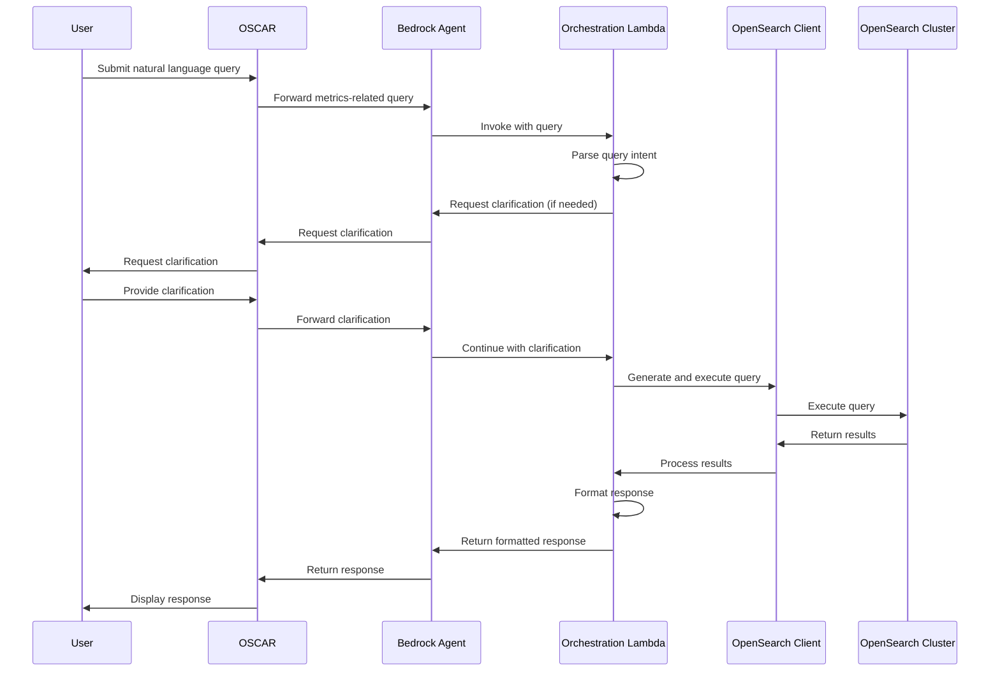

# Design Document: OpenSearch Metrics Integration

## Overview

This design outlines the architecture and components for integrating OpenSearch Metrics data into the OSCAR workflow through a custom Amazon Bedrock agent. The system will enable users to query metrics data using natural language, with the agent handling the translation of these queries into OpenSearch-compatible queries, executing them against the metrics cluster, and returning formatted responses.

The integration leverages Amazon Bedrock's custom orchestration capabilities through a Lambda function that will handle the complex logic of query interpretation, execution, and response formatting. This approach allows for multi-step reasoning and data processing that would be difficult to achieve with a simpler integration.

## Architecture

The system architecture consists of the following components:

1. **OSCAR Interface**: The existing user interface where users submit queries.
2. **Bedrock Agent**: A custom agent configured in Amazon Bedrock that receives queries from OSCAR.
3. **Orchestration Lambda**: A Lambda function that implements the custom orchestration logic for the Bedrock agent.
4. **OpenSearch Client**: A component within the Lambda function that connects to and queries the OpenSearch metrics cluster.
5. **OpenSearch Metrics Cluster**: The data source containing all metrics information.

### Data Flow



## Components and Interfaces

### 1. Orchestration Lambda Function

The Lambda function will be the core component handling the orchestration logic. It will:

1. Receive input from the Bedrock agent
2. Parse the natural language query to determine intent
3. Generate appropriate OpenSearch queries
4. Execute queries against the OpenSearch cluster
5. Process and format the results
6. Return the formatted response to the Bedrock agent

#### Lambda Function Interface

```python
def handler(event, context):
    """
    Main handler for the orchestration Lambda function.
    
    Parameters:
    - event: The event data from the Bedrock agent
    - context: The Lambda execution context
    
    Returns:
    - A response object for the Bedrock agent
    """
    # Process the event and generate a response
    return {
        "messageVersion": "1.0",
        "response": {
            # Response data
        }
    }
```

### 2. Query Parser Component

This component will analyze the natural language query to determine the user's intent and extract relevant parameters.

```python
class QueryParser:
    def parse_query(self, query_text):
        """
        Parse a natural language query to determine intent and parameters.
        
        Parameters:
        - query_text: The natural language query text
        
        Returns:
        - A dictionary containing the parsed intent and parameters
        """
        # Parse the query
        return {
            "intent": "query_integration_tests",
            "parameters": {
                "build": "latest",
                "metric_type": "integration_tests",
                "status_field": "status"
            }
        }
```

### 3. OpenSearch Query Generator

This component will generate OpenSearch queries based on the parsed intent and parameters.

```python
class OpenSearchQueryGenerator:
    def generate_query(self, intent, parameters):
        """
        Generate an OpenSearch query based on the parsed intent and parameters.
        
        Parameters:
        - intent: The query intent
        - parameters: The query parameters
        
        Returns:
        - An OpenSearch query object
        """
        # Generate the query
        return {
            "query": {
                "bool": {
                    "must": [
                        # Query conditions
                    ]
                }
            }
        }
```

### 4. OpenSearch Client

This component will handle the connection to the OpenSearch cluster and execute queries.

```python
class OpenSearchClient:
    def __init__(self, host, port, credentials):
        """
        Initialize the OpenSearch client.
        
        Parameters:
        - host: The OpenSearch host
        - port: The OpenSearch port
        - credentials: The credentials for authentication
        """
        # Initialize the client
        
    def execute_query(self, index, query):
        """
        Execute a query against the OpenSearch cluster.
        
        Parameters:
        - index: The index to query
        - query: The query to execute
        
        Returns:
        - The query results
        """
        # Execute the query
        return {
            "hits": {
                "hits": [
                    # Query results
                ]
            }
        }
```

### 5. Response Formatter

This component will format the OpenSearch query results into a human-readable response.

```python
class ResponseFormatter:
    def format_response(self, results, intent, parameters):
        """
        Format the query results into a human-readable response.
        
        Parameters:
        - results: The query results
        - intent: The original query intent
        - parameters: The original query parameters
        
        Returns:
        - A formatted response string
        """
        # Format the response
        return "The status of integration tests for the latest build is: SUCCESS"
```

## Data Models

### 1. Query Intent Model

```python
class QueryIntent:
    def __init__(self, intent_type, parameters):
        self.intent_type = intent_type  # String: The type of query intent
        self.parameters = parameters    # Dict: The parameters for the query
```

### 2. OpenSearch Query Model

```python
class OpenSearchQuery:
    def __init__(self, index, query_body):
        self.index = index          # String: The index to query
        self.query_body = query_body  # Dict: The query body
```

### 3. Query Result Model

```python
class QueryResult:
    def __init__(self, raw_results, processed_data):
        self.raw_results = raw_results      # Dict: The raw results from OpenSearch
        self.processed_data = processed_data  # Dict: The processed data
```

## Error Handling

The system will implement comprehensive error handling to ensure robustness:

1. **Query Parsing Errors**: When the system cannot parse a query, it will request clarification from the user with specific guidance on what information is needed.

2. **OpenSearch Connection Errors**: If the system cannot connect to the OpenSearch cluster, it will return an appropriate error message indicating a system issue and suggesting to try again later.

3. **Query Execution Errors**: If a query fails to execute properly, the system will provide information about the failure and suggest alternative approaches.

4. **Empty Results**: If a query returns no results, the system will inform the user and suggest possible reasons (e.g., no data for the specified time range).

5. **Timeout Handling**: For long-running queries, the system will implement timeouts and provide partial results if available.

## Testing Strategy

The testing strategy will include:

1. **Unit Tests**: Test individual components (QueryParser, OpenSearchQueryGenerator, etc.) in isolation.

2. **Integration Tests**: Test the interaction between components within the Lambda function.

3. **End-to-End Tests**: Test the complete flow from user query to response.

4. **Performance Tests**: Ensure the system can handle expected query loads and response times.

5. **Error Handling Tests**: Verify that the system handles various error conditions gracefully.

### Test Cases

1. **Basic Query Processing**:
   - Input: "What is the status of integration tests for the latest build?"
   - Expected: System correctly identifies intent, queries OpenSearch, and returns formatted results.

2. **Ambiguous Query Handling**:
   - Input: "Show me test results"
   - Expected: System identifies ambiguity and requests clarification on test type and build.

3. **Error Handling**:
   - Scenario: OpenSearch cluster is unavailable
   - Expected: System returns appropriate error message.

4. **Complex Query Processing**:
   - Input: "Compare integration test performance between the last three builds"
   - Expected: System breaks down the query, executes multiple OpenSearch queries, and returns a comparative analysis.

## Implementation Considerations

1. **OpenSearch Schema Knowledge**: The system needs to understand the schema of the OpenSearch metrics data to generate accurate queries. This may require:
   - Storing schema information in the Lambda function
   - Dynamically querying schema information from OpenSearch
   - Using a combination of predefined query templates and dynamic parameters

2. **Query Complexity Handling**: For complex queries that require multiple data points or calculations:
   - Implement a multi-step query execution strategy
   - Use temporary storage for intermediate results if needed
   - Consider implementing query optimization techniques

3. **Performance Optimization**:
   - Implement caching for frequently accessed data
   - Use efficient query patterns for OpenSearch
   - Consider pagination for large result sets

4. **Monitoring and Logging**:
   - Implement comprehensive logging for debugging
   - Set up monitoring for Lambda function performance
   - Track query patterns and performance to identify optimization opportunities