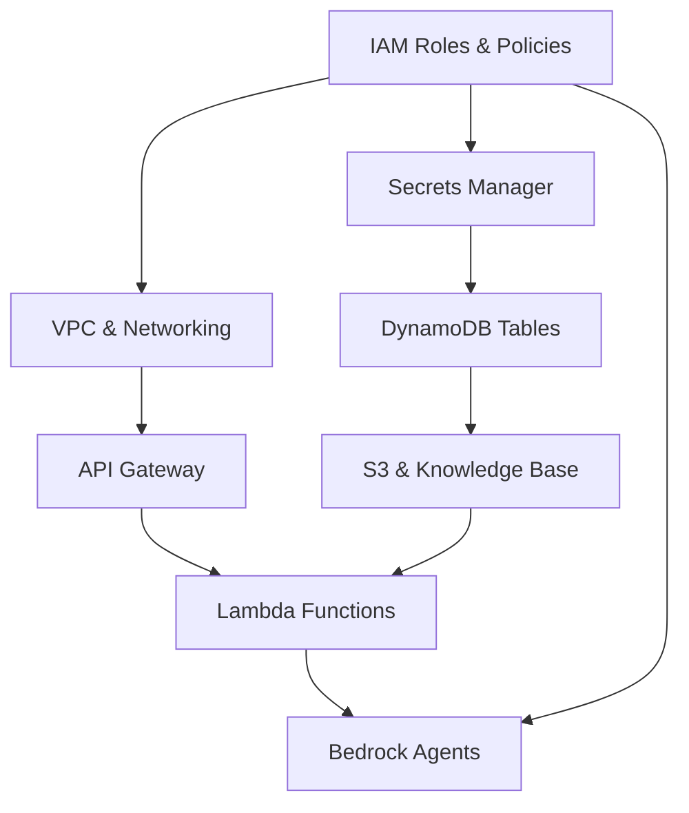

# OSCAR CDK Deployment Execution Plan

## Overview

This document outlines the comprehensive execution plan for creating an automated CDK deployment system for all OSCAR (OpenSearch Conversational Automation for Releases) components. The goal is to create a fully automated, repeatable deployment that can recreate the entire OSCAR infrastructure from scratch while preserving all current configurations and functionality.

## Current State Analysis

### Existing Infrastructure
- **Bedrock Agents**: 2 agents (privileged: `NFCKXG7OIN`, limited: `DKGVSQJG3D`)
- **Knowledge Base**: Existing KB (`NBRUVWHAYY`)
- **Lambda Functions**: 7+ functions deployed in VPC with specific configurations
- **DynamoDB**: Context and sessions tables with TTL
- **VPC Configuration**: Specific VPC (`vpc-0f2061a1321c2d669`) with 6 subnets
- **OpenSearch**: Cross-account VPC endpoint access
- **API Gateway**: Slack webhook integration
- **Secrets**: Currently using `.env` file

### Current Challenges
- Fragmented CDK implementation
- Manual deployment processes
- No automated agent configuration
- Missing knowledge base automation
- Inconsistent permission management

## Deployment Architecture

### Component Dependencies


## Detailed Execution Plan

### Phase 1: Foundation Infrastructure (IAM & Security)

#### 1.1 IAM Roles and Policies Stack
**File**: `cdk/stacks/permissions_stack.py`

**Components**:
- **Bedrock Agent Execution Role**
  - Trust policy for Bedrock service
  - Permissions for Lambda invocation
  - Knowledge base access
  - DynamoDB access
  - Secrets Manager access

- **Lambda Execution Roles**
  - VPC execution permissions
  - DynamoDB read/write
  - Bedrock agent invocation
  - OpenSearch cross-account access
  - Secrets Manager access

- **Cross-Account OpenSearch Role**
  - Assume role permissions for account `979020455945`
  - OpenSearch domain access

- **API Gateway Execution Role**
  - Lambda invocation permissions
  - CloudWatch logging

**Key Policies**:
```json
{
  "Version": "2012-10-17",
  "Statement": [
    {
      "Effect": "Allow",
      "Action": [
        "bedrock-agent-runtime:InvokeAgent",
        "bedrock-agent:*",
        "bedrock:InvokeModel"
      ],
      "Resource": "*"
    }
  ]
}
```

#### 1.2 Secrets Manager Stack
**File**: `cdk/stacks/secrets_stack.py`

**Components**:
- **Central Environment Secret** (`oscar-central-env`)
  - Migration of `.env` contents
  - Secure parameter storage
  - Automatic rotation capabilities

- **Jenkins API Token Secret**
  - Separate secret for Jenkins credentials
  - Cross-reference from main secret

**Implementation**:
- Script to migrate `.env` to Secrets Manager
- Validation of secret structure
- Access policies for Lambda functions

### Phase 2: Data and Storage Layer

#### 2.1 DynamoDB Tables Stack
**File**: `cdk/stacks/storage_stack.py` (Enhanced)

**Tables**:
- **Context Table** (`oscar-agent-context`)
  - Partition key: `thread_key` (STRING)
  - TTL: 7 days (604800 seconds)
  - Encryption: AWS managed
  - Billing: Pay-per-request

- **Sessions Table** (`oscar-agent-sessions`)
  - Partition key: `event_id` (STRING)
  - TTL: 1 hour (3600 seconds)
  - Encryption: AWS managed
  - Billing: Pay-per-request

**Features**:
- Point-in-time recovery
- CloudWatch metrics
- Backup policies

#### 2.2 VPC and Networking Stack
**File**: `cdk/stacks/vpc_stack.py`

**Components**:
- **VPC Configuration**
  - Use existing VPC: `vpc-0f2061a1321c2d669`
  - Import existing subnets
  - Security group for Lambda functions

- **Security Groups**
  - Lambda security group with OpenSearch access
  - Outbound HTTPS for external APIs
  - VPC endpoint access

- **VPC Endpoints** (if needed)
  - S3 VPC endpoint
  - DynamoDB VPC endpoint
  - Secrets Manager VPC endpoint

### Phase 3: API and Interface Layer

#### 3.1 API Gateway Stack
**File**: `cdk/stacks/api_gateway_stack.py`

**Components**:
- **REST API Gateway**
  - Slack webhook endpoints
  - Request validation
  - Rate limiting and throttling

- **Resources and Methods**
  - `/slack/events` - POST method for Slack events
  - `/slack/interactive` - POST method for interactive components
  - Request/response transformations

- **Security**
  - API key authentication
  - Request signing validation
  - CORS configuration

**Integration**:
- Lambda proxy integration
- Error handling and logging
- CloudWatch metrics

### Phase 4: AI and Knowledge Layer

#### 4.1 Knowledge Base Stack
**File**: `cdk/stacks/knowledge_base_stack.py`

**Components**:
- **S3 Bucket for Documents**
  - Bucket: `oscar-knowledge-documents-{account-id}`
  - Versioning enabled
  - Lifecycle policies
  - Public access blocked

- **OpenSearch Serverless Collection**
  - Vector search configuration
  - Encryption at rest
  - Network policies

- **Knowledge Base Configuration**
  - Document ingestion from S3
  - Vector embeddings (Titan)
  - Chunking strategy
  - Metadata extraction

**Document Management**:
- Automated ingestion from `cdk/knowledge_docs/`
- Document preprocessing
- Index management
- Sync jobs

#### 4.2 Lambda Functions Stack
**File**: `cdk/stacks/lambda_stack.py` (Comprehensive)

**Functions**:

1. **Metrics Lambda Functions** (VPC Deployed)
   - `oscar-test-metrics-agent-new`
   - `oscar-build-metrics-agent-new`
   - `oscar-release-metrics-agent-new`
   - `oscar-deployment-metrics-agent-new`

2. **Communication Handler**
   - `oscar-communication-handler`
   - Bedrock action group integration
   - Message formatting and routing

3. **Main OSCAR Agent**
   - `oscar-supervisor-agent`
   - Slack event processing
   - Agent orchestration

4. **Jenkins Agent**
   - `oscar-jenkins-agent`
   - Jenkins API integration
   - Job execution and monitoring

**Configuration**:
- VPC deployment with existing subnets
- Environment variables from Secrets Manager
- Proper timeout and memory settings
- Dead letter queues
- CloudWatch logging

**Deployment Strategy**:
- Code-only updates preserve permissions
- Layered deployment approach
- Dependency management
- Rollback capabilities

### Phase 5: AI Agents Layer

#### 5.1 Bedrock Agents Stack
**File**: `cdk/stacks/agents_stack.py`

**Agent Configurations**:

1. **Privileged Agent** (`NFCKXG7OIN`)
   - Full access capabilities
   - All action groups enabled
   - Knowledge base integration
   - Foundation model: Claude 3.5 Sonnet

2. **Limited Agent** (`DKGVSQJG3D`)
   - Read-only access
   - Restricted action groups
   - Knowledge base integration
   - Foundation model: Claude 3.5 Haiku

**Action Groups**:
- **Communication Orchestration**
  - Lambda: `oscar-communication-handler`
  - API schema definition
  - Message sending capabilities

- **Metrics Analysis**
  - Lambda functions for each metrics type
  - OpenSearch query capabilities
  - Data visualization

- **Jenkins Operations**
  - Lambda: `oscar-jenkins-agent`
  - Job triggering and monitoring
  - Build status reporting

**Knowledge Base Integration**:
- Associate with created knowledge base
- Configure retrieval settings
- Set up guardrails

## Implementation Details

### File Structure
```
cdk/
├── agents/
│   ├── configs/
│   │   ├── privileged_agent_config.json
│   │   ├── limited_agent_config.json
│   │   └── action_groups/
│   │       ├── communication_orchestration.json
│   │       ├── metrics_analysis.json
│   │       └── jenkins_operations.json
│   └── schemas/
│       ├── communication_api_schema.json
│       ├── metrics_api_schema.json
│       └── jenkins_api_schema.json
├── knowledge_docs/
│   ├── opensearch_documentation/
│   ├── release_procedures/
│   ├── troubleshooting_guides/
│   └── api_references/
├── stacks/
│   ├── __init__.py
│   ├── permissions_stack.py
│   ├── secrets_stack.py
│   ├── storage_stack.py
│   ├── vpc_stack.py
│   ├── api_gateway_stack.py
│   ├── knowledge_base_stack.py
│   ├── lambda_stack.py
│   └── agents_stack.py
├── scripts/
│   ├── extract_agent_configs.py
│   ├── migrate_env_to_secrets.py
│   ├── deploy_full_stack.py
│   ├── update_components.py
│   └── validate_deployment.py
├── utils/
│   ├── __init__.py
│   ├── config_loader.py
│   ├── agent_config_builder.py
│   └── deployment_validator.py
├── app.py
├── cdk.json
└── requirements.txt
```

### Configuration Management

#### Agent Configuration Extraction
**Script**: `cdk/scripts/extract_agent_configs.py`

```python
def extract_agent_config(agent_id: str) -> dict:
    """Extract complete agent configuration including:
    - Agent metadata and settings
    - Action groups and functions
    - Knowledge base associations
    - Foundation model configuration
    - Instruction sets
    - Collaborator settings
    """
    pass

def save_agent_config(config: dict, filename: str):
    """Save agent configuration to JSON file"""
    pass
```

#### Environment Migration
**Script**: `cdk/scripts/migrate_env_to_secrets.py`

```python
def migrate_env_to_secrets():
    """Migrate .env contents to AWS Secrets Manager"""
    pass

def validate_secrets_migration():
    """Validate that all required secrets are properly stored"""
    pass
```

### Deployment Scripts

#### Main Deployment Script
**Script**: `cdk/scripts/deploy_full_stack.py`

```bash
#!/bin/bash
# OSCAR Complete Infrastructure Deployment

# Phase 1: Foundation
echo "🏗️ Phase 1: Deploying Foundation Infrastructure..."
cdk deploy OscarPermissionsStack --require-approval never
cdk deploy OscarSecretsStack --require-approval never

# Phase 2: Data Layer
echo "🗄️ Phase 2: Deploying Data Layer..."
cdk deploy OscarStorageStack --require-approval never
cdk deploy OscarVpcStack --require-approval never

# Phase 3: Interface Layer
echo "🌐 Phase 3: Deploying Interface Layer..."
cdk deploy OscarApiGatewayStack --require-approval never

# Phase 4: AI Layer
echo "🤖 Phase 4: Deploying AI Layer..."
cdk deploy OscarKnowledgeBaseStack --require-approval never
cdk deploy OscarLambdaStack --require-approval never

# Phase 5: Agents
echo "🧠 Phase 5: Deploying Bedrock Agents..."
cdk deploy OscarAgentsStack --require-approval never

echo "✅ OSCAR Infrastructure Deployment Complete!"
```

#### Component Update Script
**Script**: `cdk/scripts/update_components.py`

```python
def update_lambda_code_only():
    """Update Lambda function code without changing permissions"""
    pass

def update_agent_configurations():
    """Update Bedrock agent configurations"""
    pass

def update_knowledge_base():
    """Update knowledge base with new documents"""
    pass
```

### Validation and Testing

#### Deployment Validation
**Script**: `cdk/scripts/validate_deployment.py`

```python
def validate_infrastructure():
    """Validate all infrastructure components are properly deployed"""
    pass

def test_agent_functionality():
    """Test Bedrock agents are responding correctly"""
    pass

def test_lambda_functions():
    """Test all Lambda functions are operational"""
    pass

def test_end_to_end():
    """Test complete OSCAR workflow"""
    pass
```

## Deployment Sequence

### Pre-Deployment Checklist
- [ ] AWS CLI configured with appropriate permissions
- [ ] CDK CLI installed and bootstrapped
- [ ] Current agent configurations backed up
- [ ] Environment variables documented
- [ ] VPC and subnet IDs verified

### Deployment Steps

1. **Extract Current Configurations**
   ```bash
   python cdk/scripts/extract_agent_configs.py
   ```

2. **Migrate Environment Variables**
   ```bash
   python cdk/scripts/migrate_env_to_secrets.py
   ```

3. **Deploy Infrastructure**
   ```bash
   python cdk/scripts/deploy_full_stack.py
   ```

4. **Validate Deployment**
   ```bash
   python cdk/scripts/validate_deployment.py
   ```

5. **Test Functionality**
   ```bash
   # Test in Slack
   @oscar hello
   @oscar show me test metrics
   ```

### Post-Deployment Tasks

- [ ] Update Slack app webhook URLs
- [ ] Verify agent permissions
- [ ] Test knowledge base queries
- [ ] Monitor CloudWatch logs
- [ ] Update documentation

## Rollback Strategy

### Component-Level Rollback
- Each stack can be rolled back independently
- Lambda functions maintain previous versions
- Agent configurations can be restored from JSON backups

### Full Rollback
- CloudFormation stack deletion in reverse order
- Restore from configuration backups
- Re-deploy using legacy scripts if needed

## Monitoring and Maintenance

### CloudWatch Dashboards
- Lambda function metrics
- API Gateway performance
- DynamoDB usage
- Bedrock agent invocations

### Automated Alerts
- Lambda function errors
- API Gateway throttling
- DynamoDB capacity issues
- Agent invocation failures

### Regular Maintenance
- Knowledge base document updates
- Agent configuration reviews
- Permission audits
- Cost optimization

## Security Considerations

### Access Control
- Least privilege IAM policies
- Secrets Manager for sensitive data
- VPC isolation for Lambda functions
- API Gateway authentication

### Data Protection
- Encryption at rest for all storage
- Encryption in transit for all communications
- Secure parameter handling
- Audit logging

### Compliance
- CloudTrail logging
- Config rules for compliance
- Regular security assessments
- Incident response procedures

## Cost Optimization

### Resource Sizing
- Right-sized Lambda functions
- Appropriate DynamoDB billing mode
- Optimized VPC configuration
- Efficient knowledge base indexing

### Cost Monitoring
- CloudWatch cost metrics
- Budget alerts
- Resource utilization tracking
- Regular cost reviews

## Success Criteria

### Functional Requirements
- [ ] All Lambda functions deploy successfully
- [ ] Bedrock agents respond correctly
- [ ] Knowledge base queries work
- [ ] Slack integration functional
- [ ] Jenkins operations work
- [ ] Metrics collection operational

### Non-Functional Requirements
- [ ] Deployment completes in under 30 minutes
- [ ] Zero downtime for updates
- [ ] All security requirements met
- [ ] Cost within expected range
- [ ] Performance meets SLAs

## Risk Mitigation

### Technical Risks
- **Risk**: CDK deployment failures
- **Mitigation**: Incremental deployment, rollback procedures

- **Risk**: Permission issues
- **Mitigation**: Comprehensive testing, least privilege validation

- **Risk**: Data loss during migration
- **Mitigation**: Backup procedures, validation scripts

### Operational Risks
- **Risk**: Extended downtime
- **Mitigation**: Blue-green deployment, health checks

- **Risk**: Configuration drift
- **Mitigation**: Infrastructure as code, regular audits

## Timeline

### Phase 1: Foundation (Week 1)
- Day 1-2: Extract current configurations
- Day 3-4: Implement permissions and secrets stacks
- Day 5: Testing and validation

### Phase 2: Core Infrastructure (Week 2)
- Day 1-2: Storage and VPC stacks
- Day 3-4: API Gateway stack
- Day 5: Integration testing

### Phase 3: AI Components (Week 3)
- Day 1-3: Knowledge base and Lambda stacks
- Day 4-5: Bedrock agents stack
- Day 5: End-to-end testing

### Phase 4: Validation and Documentation (Week 4)
- Day 1-2: Comprehensive testing
- Day 3-4: Documentation updates
- Day 5: Production deployment

## Conclusion

This execution plan provides a comprehensive roadmap for automating the OSCAR infrastructure deployment using AWS CDK. The modular approach ensures maintainability, the phased deployment reduces risk, and the extensive validation ensures reliability.

The end result will be a fully automated, repeatable deployment system that can recreate the entire OSCAR infrastructure from scratch while maintaining all current functionality and improving operational efficiency.